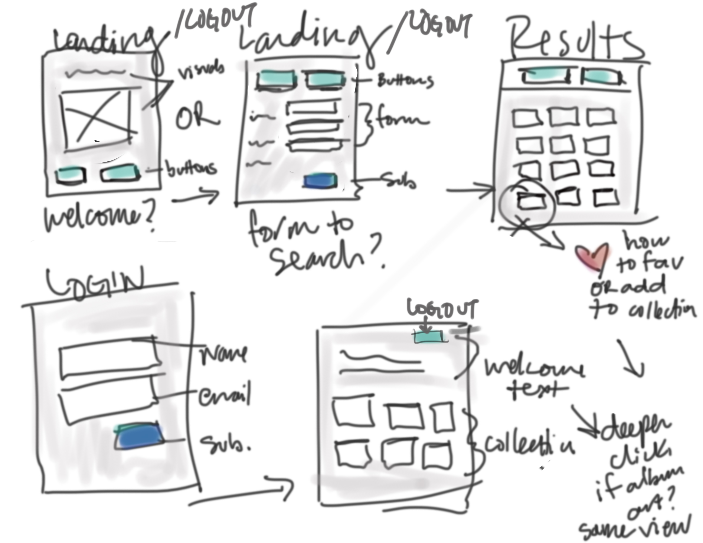

# Discog App

Discogs API: https://www.discogs.com/developers/
Discogs API Forum: https://www.discogs.com/forum/topic/1082

###Images:
https://www.discogs.com/developers/#page:marketplace,header:marketplace-price-suggestions
The Image resource represents a user-contributed image of a database object, such as Artists or Releases. Image requests require authentication and are subject to rate limiting.

It’s unlikely that you’ll ever have to construct an image URL; images keys on other resources use fully-qualified URLs, including hostname and protocol. To retrieve images, authenticate via OAuth or Discogs Auth and fetch the object that contains the image of interest (e.g., the release, user profile, etc.). The image URL will be in the response using the HTTPS protocol, and requesting that URL should succeed.

###Price:
https://www.discogs.com/developers/#page:marketplace,header:marketplace-price-suggestions
Retrieve price suggestions for the provided Release ID. If no suggestions are available, an empty object will be returned.
Authentication is required, and the user needs to have filled out their seller settings. Suggested prices will be denominated in the user’s selling currency.

## User Stories

*I would love for this app is to search the database and return the current price reflected for the chosen album (for both guests and users) - but in reading the documenation I'm not sure this is possible without linking to an actual discogs account. If I cannot show the price, I will focus on one of the other options.*

* As a guest, I can search the database, to find a specific album/title/artist.
* As a guest, I can create an account, so I can save information about albums in my account
#### User
* As a user, I can search the database, to find a specific album/title/artist
* As a user, I can login to my account, to access stored data

##### Ideas for App Functionality
* As a user, I can add add an item to my collection
* As a user, I can delete an item from my collection
* As a user, I can view my collection

##FLOW

* Home/Landing (menu login)...search form on landing page, or button option
* Display for search results
* Login Screen
* Login Home Page that reflects user's name and links to their collection/favorites
* Collection/Favorites list view
* Collection/Favorites delete/remove...can it be done from list view or click-in to individual album and the option is found there (probably not worth it unless we can show album art)

**Favorite/Add to collection show only for logged in users or does it show and if clicked and user is not logged in the guest/user is promted to create an account or sign in to add to collection/favorite?

### Rough Wireframe
* Potential changes around possibilities of accessing images/price
* User stories reflect in views...what besides the login/logout option changes based on user?

